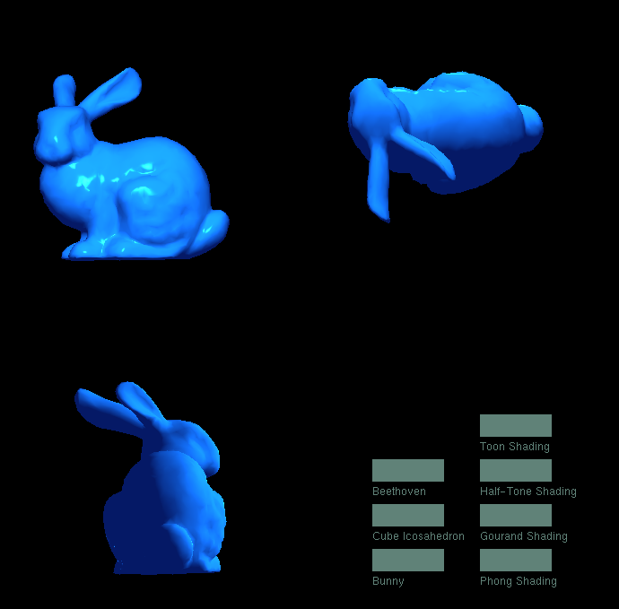

## How To Use:

1. Run the Program (Model files are big, so please wait...).
2. Click "Beethoven" or "Cube Icosahedron" or "Bunny" to switch models.
3. Click "Toon Shading" "Half-Tone Shading" "Gourand Shading" or "Phong Shading" to switch shading.
4. Enjoy!

You can see the results in ./imgs folder  
You can find a runnable version in ./Debug  

## How it works:

For each frame:
I used three 2d arrays to stroe the result of rendering, like this:  
int frameBufferR[width][height] = { 0 };  
int frameBufferG[width][height] = { 0 };  
int frameBufferB[width][height] = { 0 };  
Then render these frameBuffers only when a mouse click event is called.  

### For basic structures:
I created:
struct Vertex   // store and calculate vertex  
struct Face     // store face index  
struct Color    // store color in (0-255) format  
struct Colorf   // stroe color in (0-1) format  
struct Geometry // stroe vertices, faces, colors, specular  
class Model     // load and stroe all geometries that a model file contains  
class Zone      // store a scene with 3 perspectives  
struct IShader  // basic structure of a shader  
struct Button   // stroe location, color, and string of a button  
enum BtnState   // states of a button  

### For triangle rasterizing:
I used Barycentric Coordinate method, and implement it in these functions:  
Vertex barycentric(Vertex A, Vertex B, Vertex C, Vertex P);  
void draw_triangle_barycentric(Vertex* pts, IShader& shader);  

### For shaders:
I created 4 shaders:  
GourandShader, ToonShader, PhongShader, and HalfToneShader  
For Phong Shading, I added a bluish environment color, so models looks a little bit "Bluer"  
And some basic shader functions for convinent:  
step(float threshould, float val)  
frac(float v)  
saturate(float x)  
smoothstep(float a, float b, float x)  
circle(Vertex _st, float _radius)  
